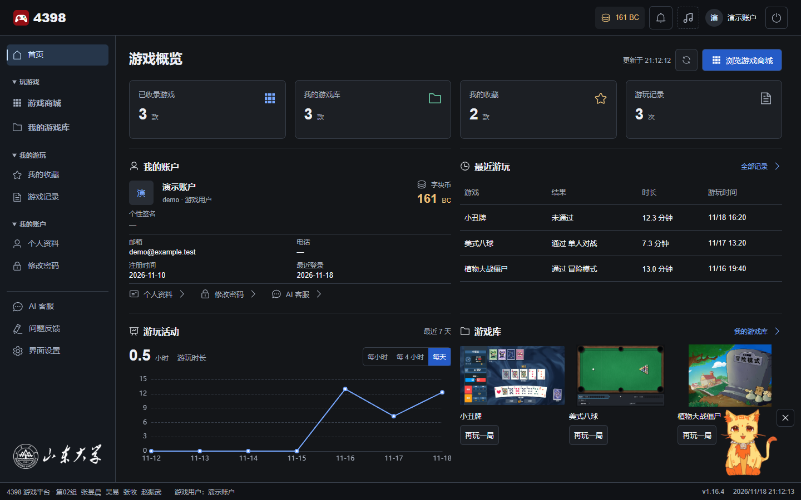
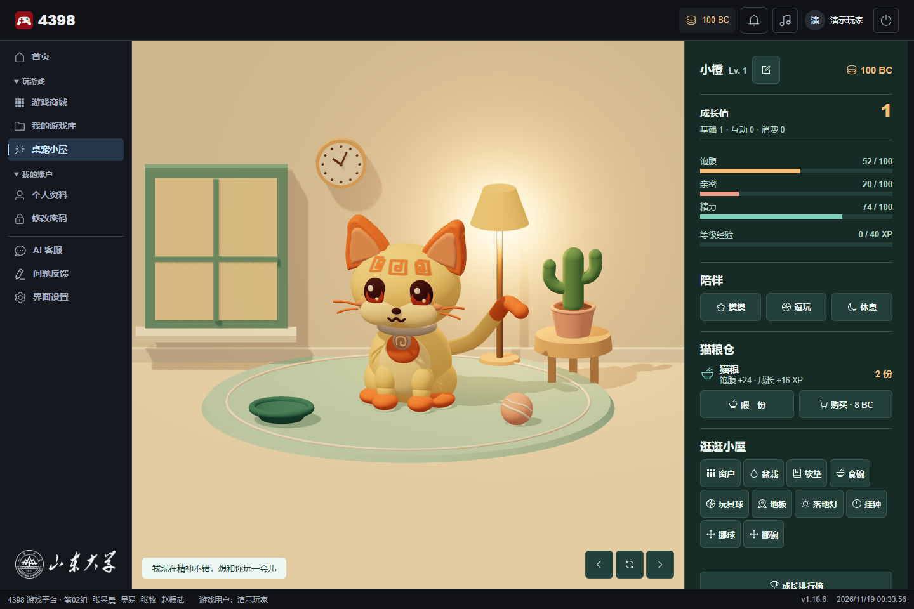

# 4398

4398 是一个用 Vue、Spring Boot 和 MySQL 搭建的游戏站。可以在浏览器里玩植物大战僵尸、美式八球和小丑牌，用字块币购买游戏，查看自己的游戏库与游玩记录。站内还有 AI 客服、消息中心和桌宠小屋。

## 更新日志

从 `v1.12.0` 起，大更新增加次版本号，小更新增加补丁号。这里按次版本合并记录。

### v1.18.x · 桌宠养成

- 互动、等级经验和猫粮实付字块币计入成长值。全服榜展示前 20 名和自己的名次，同分并列
- 猫粮即时入库，饱腹低于 100 也可喂食，离开小屋时将本次消费汇总为一条站内消息
- 桌宠默认叫小橙，可随时改名，成长榜同步显示宠物昵称。小屋和浮动桌宠会根据饱腹、精力和库存自动轮换自言自语
- 球和食碗可长按拖动，小橙会走过去归位；逗玩时先站稳再迈步拨球，睡觉时头部留在地垫上方
- 左侧导航在矮窗口自动收紧，保留滚动访问

### v1.17.x · 桌宠小屋

- cga！「我的游戏库」下新增 3D 桌宠小屋了，可旋转观察、摸摸、逗玩你的桌宠，它还可以休息和吃饭
- 猫粮需要用字块币购买

### v1.16.x · 小丑牌与游戏厅

- 《小丑牌》接入浏览器，支持按账户续玩、开场发牌音效和独立音效音量，平台记录游玩时长
- 调整游戏厅四区布局、商城与游戏库，商城内可切换游戏资料管理，侧栏补齐个人资料和修改密码入口
- 改版登录和注册界面，统一账户表单样式，修复切页闪烁、按钮悬停及 `start.cmd` 退出残留后台进程等问题

[查看详细更新记录及更早版本](docs/update-history.md)

## 界面预览

| 游戏商城 | 桌宠小屋 |
| :---: | :---: |
|  |  |

[新版睡姿](docs/images/pet-room-rest.png) · [更多界面截图](docs/interface-preview.md)

## 运行与文档

源码版需要 JDK 21、Node.js、MySQL 和数据库、JWT 配置；AI 功能另需百炼密钥。源码不附数据库或云端密钥。

- [教师运行包](docs/delivery.md) · [源码运行与前端构建](web-vue/README.md) · [数据库配置](database/README.md)
- [项目结构](docs/project-structure.md) · [游戏接入](docs/game-integration.md) · [字块币与商城](docs/blockcoin.md)
